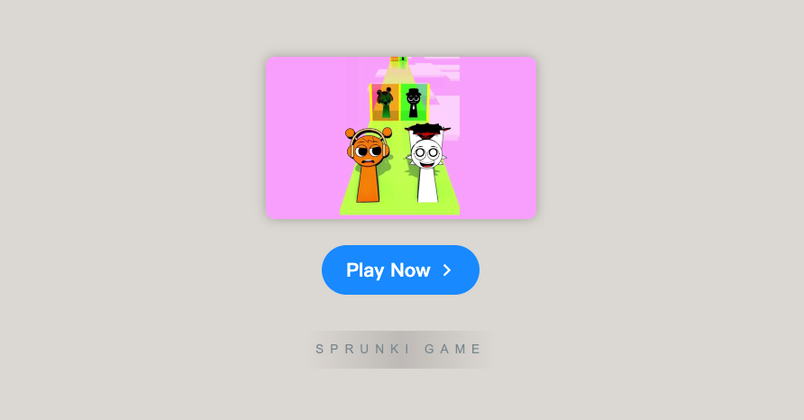

# Sprunki Romantic Kiss Run Challenge

    

Welcome to **[Sprunki Romantic Kiss Run Challenge](https://sprunkionline.com/sprunki-romantic-kiss-run-challenge)**, an innovative and captivating music-making game that brilliantly merges creativity, rhythm, and visual art in a highly engaging format. This phase of Incredibox invites players to immerse themselves in a vibrant universe filled with quirky characters, thrilling challenges, and a delightful blend of humor and romance. With its engaging gameplay and dynamic animations, this game offers an exceptional experience where players can test their reflexes, timing, and creativity. Don’t miss the chance to also play **[Sprunki x Regretevator](https://sprunkionline.com/x-regretevator/)** and **[Sprunked (Daytime Demo)](https://sprunkionline.com/sprunked-daytime-demo-mod)**, each offering distinct challenges and musical experiences!

### Table of Contents
- Introduction
- Features
- Gameplay Overview
- Romantic Kiss Run Challenge Highlights
- Tips for Success
- Resources

### Introduction

**[Sprunki Romantic Kiss Run Challenge](https://sprunkionline.com/sprunki-romantic-kiss-run-challenge)** is a highly interactive and visually appealing game that combines music, rhythm, and humorous animations. The game revolves around the concept of a fun and competitive race between two characters, Wenda and Oren, as they navigate various challenges and obstacles, all set in a whimsical world. The objective is not only to race but also to engage with the musical elements, providing a unique gaming experience where players can control both the pace of the race and the rhythm of the game’s soundtrack.

### Features

| Feature                       | Description                                                                                                  |
|-------------------------------|--------------------------------------------------------------------------------------------------------------|
| **Character Selection**        | Choose between two charming characters, Wenda and Oren, each with their own unique abilities and animations.    |
| **Race Mechanics**             | Race through levels with tricky obstacles, dodging objects, and interacting with the environment.              |
| **Romantic Challenges**        | Fun romantic-themed obstacles such as flying hearts, flower showers, and love letters to add whimsy to the race. |
| **Music and Rhythm Integration**| Match the rhythm of the game’s soundtrack to unlock power-ups and abilities.                                  |
| **Power-Ups and Upgrades**     | Collect boosts and items like shields, speed boosts, or time slowdowns to enhance your race performance.       |
| **Multiplayer Mode**           | Compete against other players in multiplayer races for the ultimate challenge.                                |
| **Visual Feedback**            | Vibrant animations and dynamic visual cues that adjust to the rhythm of the soundtrack, immersing players in the experience. |
| **Replayability**              | Multiple levels, increasing difficulty, and a variety of characters and power-ups encourage repeated play.    |

### Gameplay Overview

The **Sprunki Romantic Kiss Run Challenge** combines exciting racing action with engaging rhythm-based gameplay. Here’s a breakdown of how to play:

1. **Character Selection**: Choose between Wenda, known for her playful agility, or Oren, who brings strength and endurance to the race. Each character has unique abilities that make the game more exciting.
2. **Race Mechanics**: Navigate through levels filled with obstacles, avoiding objects and interacting with the environment. Players need to time their movements precisely to keep up with the rhythm and avoid obstacles.
3. **Romantic Challenges**: Engage in quirky romantic-themed interactions, such as kissing under a flower shower or dodging flying hearts, adding a humorous and light-hearted element to the game.
4. **Music and Rhythm**: Sync with the game’s playful soundtrack to unlock abilities like speed boosts and invincibility. The soundtrack dynamically adjusts to the player's performance.
5. **Power-Ups**: Collect power-ups like shields, jumps, and time slowdowns to enhance your gameplay. Strategic use of power-ups is essential for completing tricky levels.
6. **Multiplayer Mode**: Race head-to-head against friends or online players in multiplayer mode for added competition and fun.
7. **Visual Design**: The vibrant, colorful visuals react to the rhythm of the game’s soundtrack, creating an immersive experience as players race through different levels.

### Romantic Kiss Run Challenge Highlights

- **Engaging Characters**: Choose between Wenda and Oren, each with unique abilities and animations that make the race more fun.
- **Dynamic Soundtrack**: Sync with the game’s energetic soundtrack to unlock new abilities and stay on top of the competition.
- **Quirky Obstacles**: Romantic-themed challenges such as flying hearts and flower showers add whimsy and humor to the gameplay.
- **Multiplayer Competition**: Race against others online in multiplayer mode for a fun, competitive twist.
- **Visually Stunning Animations**: Bright, colorful animations that change with the rhythm of the soundtrack create a visually engaging experience.

### Tips for Success

1. **Master the Rhythm**: Keep in sync with the music to time your movements and jumps correctly, helping you avoid obstacles and gain speed boosts.
2. **Collect Power-Ups**: Pay attention to power-ups as you race, as they can provide temporary invincibility or other boosts to improve your performance.
3. **Avoid Distractions**: Stay focused on the race, despite the whimsical romantic obstacles that may pop up. Precision is key to success.
4. **Compete with Friends**: Take advantage of the multiplayer mode to challenge your friends or race against players worldwide. Aim for the best times and highest scores!

### Resources

- [Sprunki Romantic Kiss Run Challenge](https://sprunkionline.com/sprunki-romantic-kiss-run-challenge)
- [Sprunki Romantic Challenge](https://sprunkionline.com/sprunki-romantic-challenge)

Embrace your inner racer, synchronize with the rhythm, and let **Sprunki Romantic Kiss Run Challenge** guide you to victory! Whether you're racing through whimsical romantic challenges or syncing with the catchy beats of the soundtrack, this game promises a delightful experience for players of all ages.
